# Smart File Organizer

A Python-based file organization tool with GUI that automatically sorts files by extension, supports undo operations, and provides real-time logging of all activities.

## Key Features
* **Test Mode**: Preview organization without making actual changes
* **Undo Support**: Restore files to original locations with precise control
* **Real-time Activity Log**: See every operation with timestamps
* **Duplicate Handling**: Automatic renaming prevents file conflicts
* **Start/Stop Control**: Interrupt long operations at any time
* **Persistent History**: JSON-based operation tracking survives restarts
* **Responsive UI**: Multi-threading prevents interface freezing
* **Extension Normalization**: Treats similar extensions as one (jpeg→jpg, docx→doc)
* **Automatic Folder Creation**: Creates organized subfolders as needed

## Requirements

### Python Version
* **Tested with**: Python 3.12.7
* **Compatible with**: Python 3.7+

### Required Imports
```python
import threading          # Multi-threading for non-blocking UI
import shutil            # File operations (move files)
import json              # Store/load history
from pathlib import Path # Modern file path handling
from datetime import datetime  # Timestamp logging
import tkinter as tk     # GUI framework
from tkinter import ttk, filedialog, messagebox, simpledialog 
```

No external dependencies required - uses Python standard library only!


## Core Architecture

### 1. FilePathManager Class
Handles duplicate file name conflicts by adding numeric suffixes:
- `file.txt` → `file (1).txt` → `file (2).txt`

### 2. JSONHistoryManager Class
Manages persistent operation history for undo functionality.

**History Format:**
```json
[
  {
    "from": "/path/to/source/file.txt",
    "to": "/path/to/sorted_folders/txt/file.txt",
    "time": "2025-10-31T14:30:15.123456"
  }
]
```

### 3. FileOrganizer Class
Core logic for organizing and undoing operations with:
- Stop event support for interruption
- Extension normalization
- Test mode simulation

### 4. UIComponents
Reusable UI element creation for consistent interface.

### 5. FileOrganizerApp
Main GUI application with multi-threading support for responsive operation.

## Step-by-Step Guide

#### 1. Launch Application
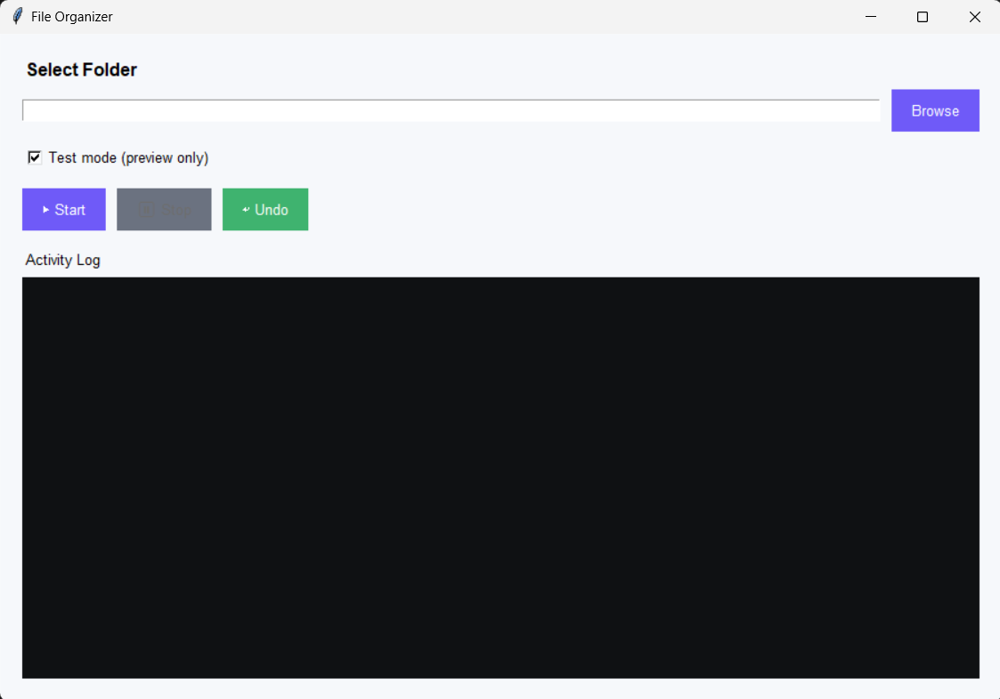
*The application opens with a clean interface*

#### 2. Select Folder
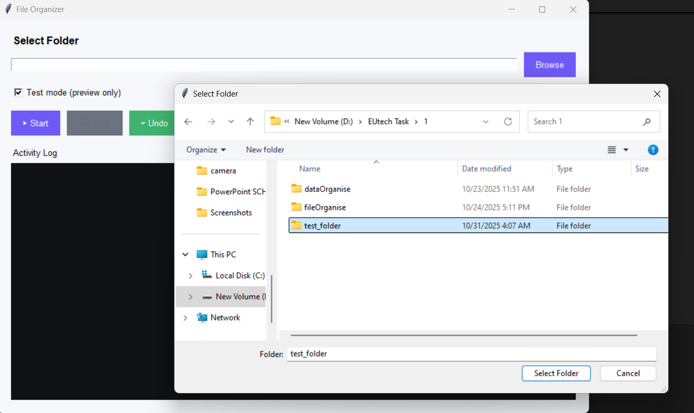
*Click "Browse" to select the folder you want to organize*

#### 3. Choose Test Mode
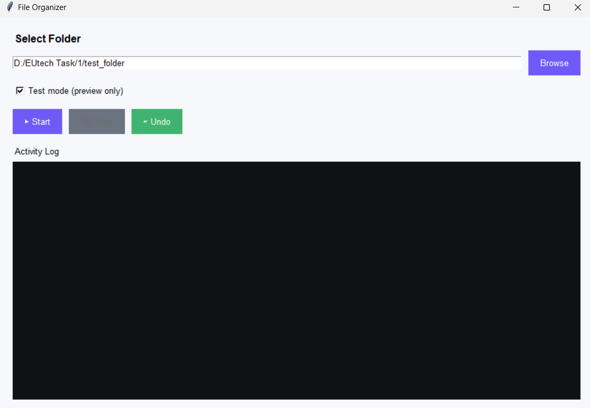
*Enable "Test mode" to preview changes without moving files*

#### 4. Start Organization
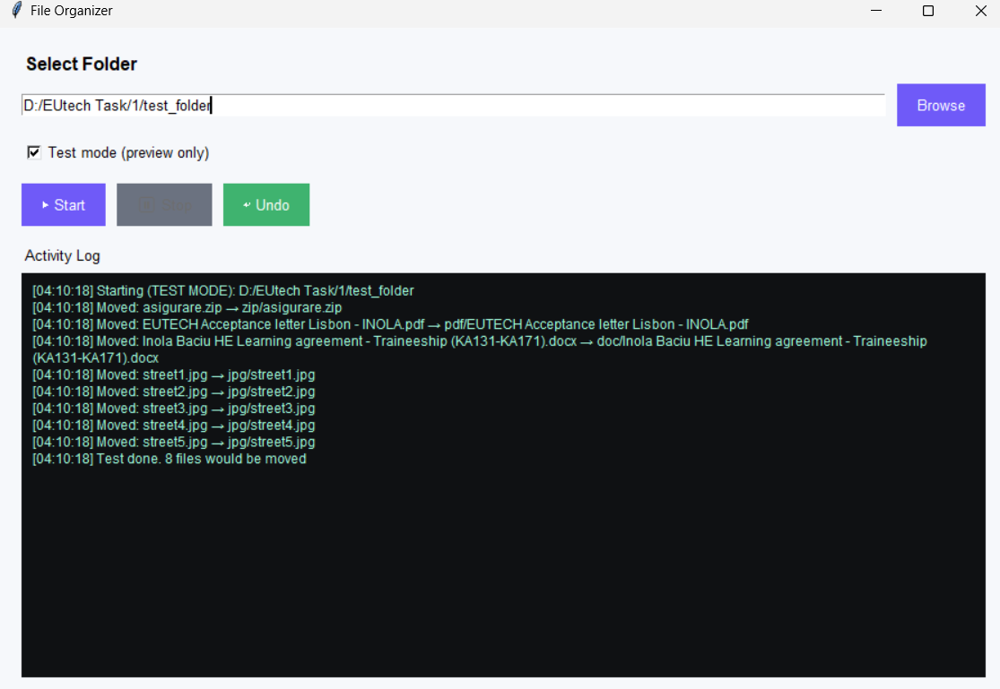
*Click "Start" to begin organizing. Activity log shows all operations*

#### 5. View Results
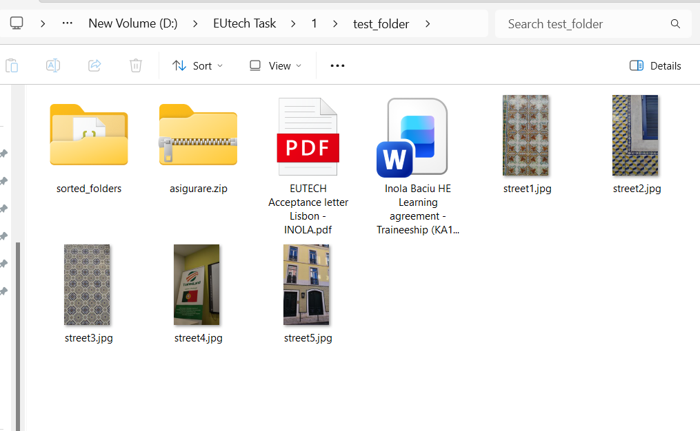
*Files are organized into subfolders by extension inside "sorted_folders"*

#### 6. Check Sorted Files
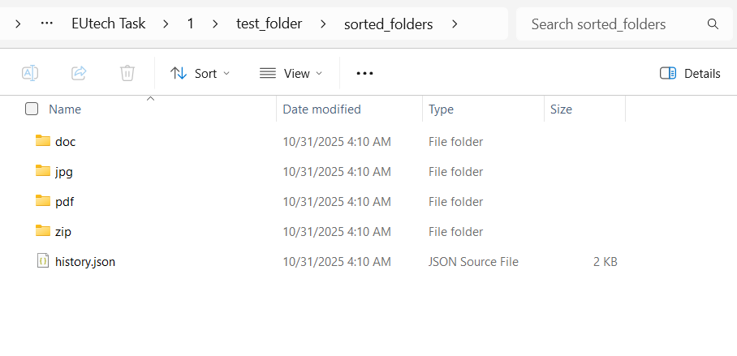
*Each extension gets its own folder (jpg, pdf, txt, etc.)*

#### 7. Test Mode Verification
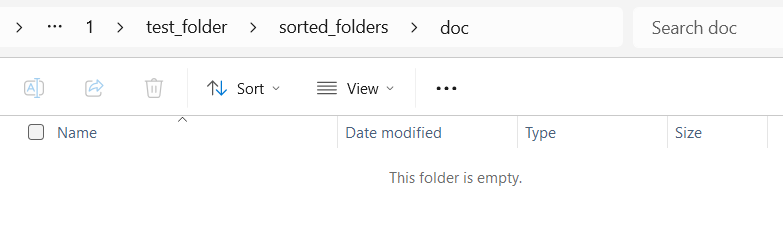
*In test mode, original folder remains unchanged*

#### 8. Undo Operations
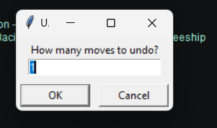
*Click "Undo" and specify how many operations to reverse*

#### 9. Nothing to Undo
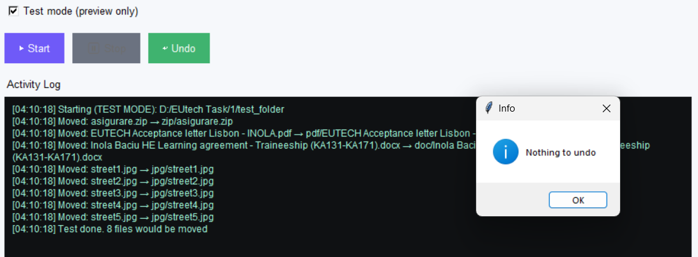
*No operations available to undo*

#### 10. Successful Undo
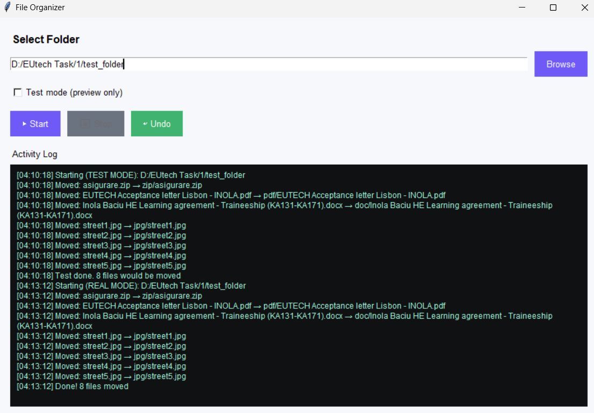
*Activity log shows files being restored to original locations. Confirmation message shows number of files restored*

#### 11. Step-by-Step Undo
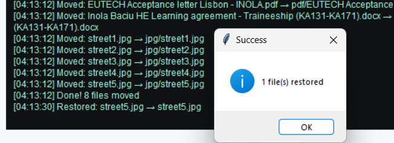
*Undo operations one at a time for precise control*

#### 12. Undo Result
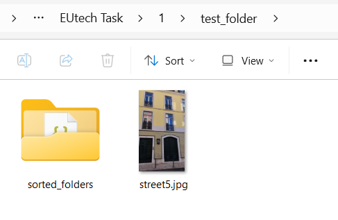
*Files successfully returned to their original locations*

#### 13. Extension Folder
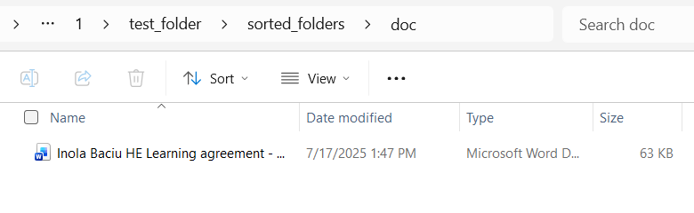
*The document is automatically moved to a folder named after its file extension (e.g., 'doc')*

## How It Works

### File Organization Logic

1. **Extension Detection**: Identifies file extensions and normalizes them (e.g., .jpeg → .jpg)
2. **Folder Creation**: Creates subfolders in `sorted_folders/` directory
3. **Duplicate Handling**: Renames files with `(1)`, `(2)`, etc. if names conflict
4. **Move Operation**: Uses `shutil.move()` to relocate files
5. **History Logging**: Saves all operations to `history.json` with timestamps

### Operation Flow
```
User selects folder → Test/Real mode → Start operation
    ↓
Scan files → Detect extensions → Normalize extensions
    ↓
Create destination folders → Check for duplicates
    ↓
Move/Simulate files → Log to history → Update UI
    ↓
Complete → Undo available
```

## Configuration

### Extension Mapping

The application automatically normalizes similar extensions:
- `jpeg` → `jpg`
- `docx` → `doc`
- Case-insensitive handling (`.TXT` → `.txt`)

To customize, modify the `get_folder_name()` method in `FileOrganizer` class.

### Test Mode vs Real Mode

- **Test Mode** (default): Simulates organization without moving files
- **Real Mode**: Actually moves files to organized folders


## Error Handling

The application handles: 
- Missing or invalid folder paths
- Duplicate filenames (automatic renaming)
- Permission errors
- Thread interruption via stop_event
- Invalid undo operations
- Non-existent history files
- Corrupted JSON history

## Project Structure
```
smartFileOrganise/
├── fileOrganise/
│   ├── smartFO.PY       # Main script
├──  screenshots/        # Application screenshots
│   ├── sc1_open.png
│   ├── sc2_findFolder.png
│   ├── sc3_selectTestMode.png
│   ├── sc4_runTest.png
│   ├── sc5_newFolder.png
│   ├── sc6_sortedExtension.png
│   ├── sc7_emptyTestFolder.png
│   ├── sc8_undoMove.png
│   ├── sc9_Undo.png
│   ├── sc10_doneMoved.png
│   ├── sc11_1stepUndo.png
│   ├── sc12_resultUndo.png
│   └── sc13_exDOCfolderMove.png
├── test_folder/            # Test directory (for testing)
└── README.md               # This file

# When application runs, it creates:
sorted_folders/             # Created in selected directory
├── history.json           # Operation history
├── jpg/                   # Image files
├── pdf/                   # PDF documents
├── txt/                   # Text files
└── ...                    # Other extensions
```
